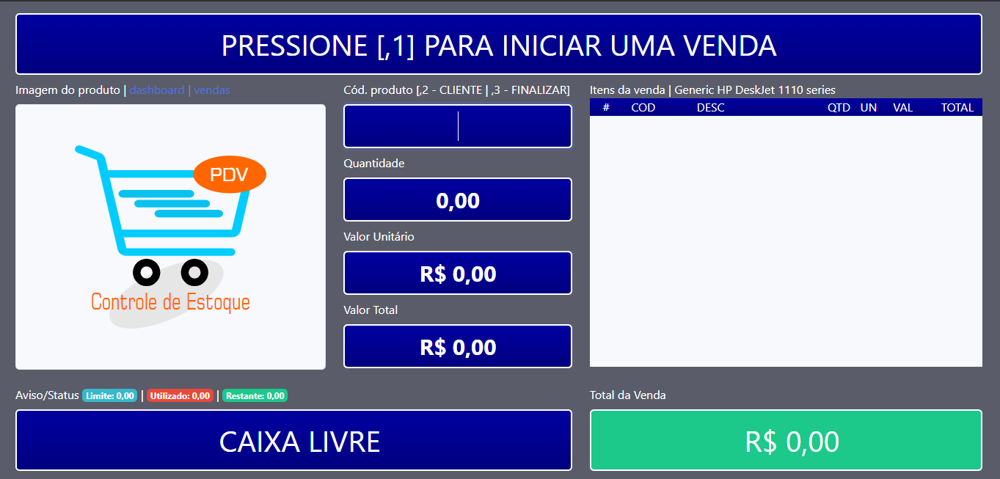
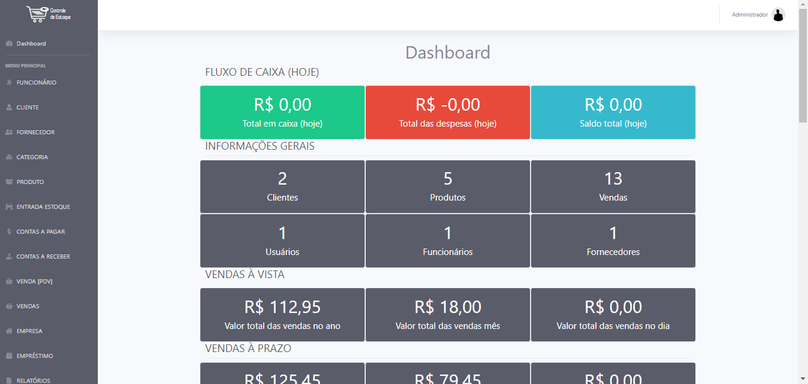
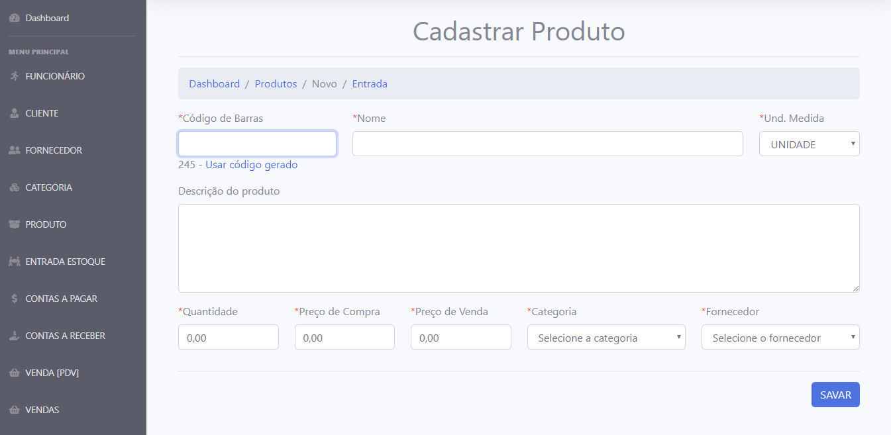
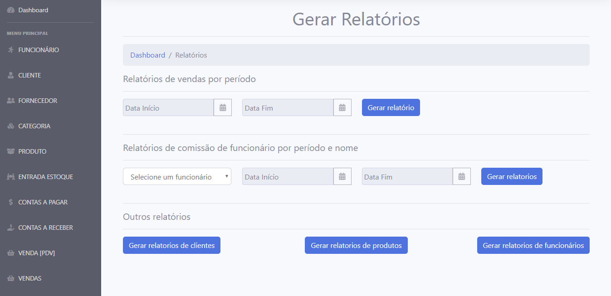
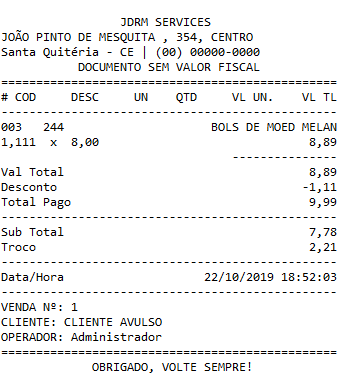

## Sistema PDV
# Tela do PDV

# Tela do Dashboard

# Tela do Dashboard Gráficos

# Tela do Cadastrar Produto

# Tela do Relatórios

# Modelo Cupom

# Tecnologias Utilizadas
* Linguagens
- Java
- HTML
- CSS
- Javascript

* Frameworks
- Spring Boot
- Spring Data JPA
- Spring Security
- Thymeleaf

* Banco de dados
- MySQL
